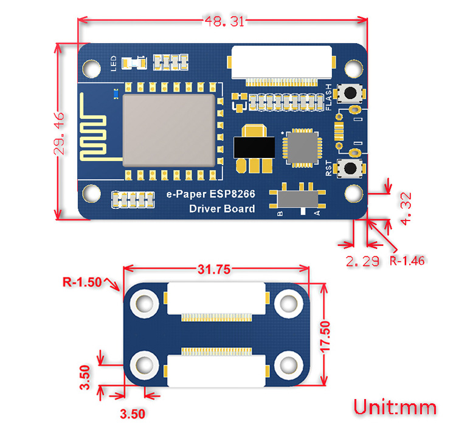
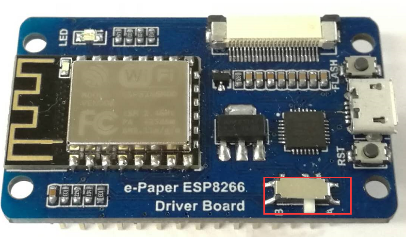
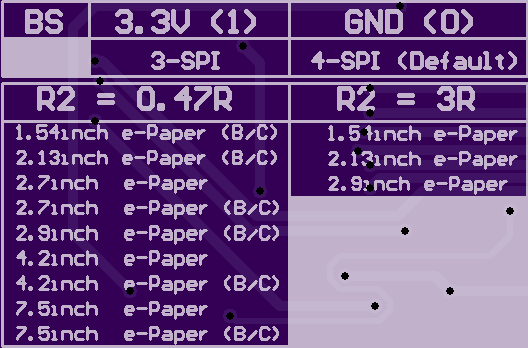

墨水屏接口：3-wire SPI、4-wire SPI(默认)

| Pin  | ESP8266    | Desc                                      |
| ---- | ---------- | ----------------------------------------- |
| VCC  | VCC        | 电源正(3.3V电源输入)                      |
| GND  | GND        | 电源地                                    |
| DIN  | GPIO13(D7) | SPI的MOSI，数据输入                       |
| SCK  | GPIO14(D5) | SPI的CLK，时钟信号输入                    |
| CS   | GPIO15(D8) | 片选，低电平有效                          |
| DC   | GPIO4(D2)  | 数据/命令，低电平表示命令，高电平表示数据 |
| RST  | GPIO2(D4)  | 复位，低电平有效                          |
| BUSY | GPIO5(D1)  | 忙状态输出引脚（表示忙碌）                |

根据墨水屏型号来拨动开关

(如果显示效果差或者无法驱动，可尝试切换开关)

| Trigger state | E-Paper                                                      |
| ------------- | ------------------------------------------------------------ |
| A             | 1.54 inch, 2.13 inch, 2.9 inch                               |
| B             | 1.54 inch(b), 2.13 inch(b), 2.7 inch, 2.7 inch(b), 2.9 inch(b), 4.2 inch, 4.2 inch (b), 7.5 inch(b), 7.5 inch(b) |

