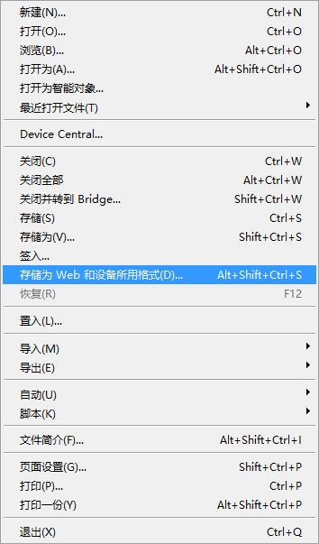

# 图片取模

## Image2Lcd

以下步骤不适用于四色墨水屏、七色墨水屏、墨水屏四灰度图片
黑白红三色墨水屏为两张黑白图片组成，取模两次即可
LCD彩色屏幕请选择16位或其他色彩

- [下载](https://www.waveshare.net/w/upload/3/36/README.7z)并打开软件

- 修改最大宽度和高度，建议和接下来要取模的图片一致（这里以1.54黑白墨水屏为例）

- 查看图片所示位置的数据是否正确

- 根据屏幕和图片的实际情况设置图片所示的每一个值

- 点击保存

- 选择一个c文件，会默认以记事本的方式打开

## Photoshop

### E-Paper-Floyd-Steinberg

- Floyd-Steinberg抖动算法非常适合在颜色数量很少的情况下，展示出丰富的层次感。使得获得更多的颜色组合，对原始图片进行更好的阴影渲染。特别适合电子墨水屏的各种使用场景。
- 以下将介绍如何将普通图片转为Floyd-Steinberg散点图。
- 如果你对实际的算法有兴趣，可以了解我们在[ESP32](https://www.waveshare.net/shop/e-Paper-ESP32-Driver-Board.htm)和[ESP8266](https://www.waveshare.net/shop/e-Paper-ESP8266-Driver-Board.htm)的算法移植。在这里不在赘述。

### 操作步骤

准备工作：将[颜色表](https://www.waveshare.net/wiki/文件:E-PAPER-ACT.zip)下载到PC机，解压得到如下图文件：
0.jpg)

1. 新键Photoshop工程，按电子墨水屏的实际分辨率设置宽度和高度，颜色模式使用RGB颜色。这里使用以7.5inch e-paper 800*480为例进行演示，如果你使用的是其它尺寸的屏，修改对应的分辨率即可。

2. 准备好相应的素材，复制到工程中，调整好大小、对比度之类的参数（和一般Photoshop的处理图片的步骤类似）。

3. 选择文件 -》存储为Web和设备所用格式。

4. 如下图选择载入颜色表。载入准备工作中所提供的颜色表。

5. 对于黑白两色的图片，载入Black-White.act，之后点击存储，保存为gif文件即可。对于不同的应用，之后可以在转换为JPG或BMP等图片格式。

其它颜色表，显示效果如下：

* Black-White-Red.act 黑白红三色电子墨水屏

* Black-White-Yellow.act 黑白黄三色电子墨水屏

* N-color.act 黑白红绿蓝黄橙七色电子墨水屏

