E-Paper_ESP32_Driver_Board_Code：C

Pico_ePaper_Code：C & MircoPython

---

墨水屏原理、驱动方法、刷新方式（全刷、快刷、局刷） [zhihu](https://zhuanlan.zhihu.com/p/618868898) 

## 1 墨水屏原理

参考文献：[E Ink 元太科技 电子墨水技术](https://link.zhihu.com/?target=https%3A//cn.eink.com/tech/detail/How_it_works)（文中图片来源）

　　在微胶囊或者微杯中注入液体，在液体中悬浮着2种或多种不同尺寸的带有不同电荷的颜色颗粒，通过电场变化控制颜色颗粒的位置，外观显示为最上面的颗粒的颜色，即电泳显示（Electrophoretic，E-Paper）。

　　常见墨水屏的颜色颗粒数量有：2、3、4。

　　颜色有：

1. 黑、白
2. 黑、白、红
3. 黑、白、黄
4. 黑、白、红、黄
5. 彩色（青、黄、品红、白）（颜料三原色+白色）

### 1.1 双色墨水屏

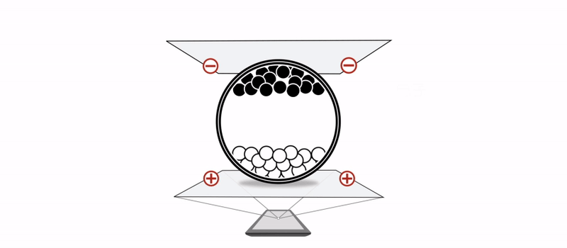

施加向下的电场显示白色，施加向上的电场显示黑色。

### 1.2 三色墨水屏

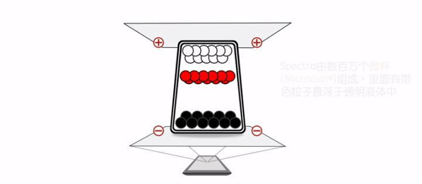

　　施加向下的电场显示白色，施加向上的高压电场（+15V）显示黑色，施加向上的高压电场（+5V）显示红色。由于红色和黑色都带正电，在显示红色时会有些发黑，于是在+5V中插入许多短暂的-15V。

　　实际中不是先显示红色再转换为黑色，而实直接施加高电压显示黑色。

### 1.3 四色墨水屏（彩色、7色墨水屏）

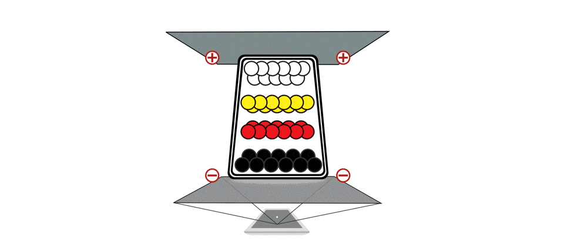

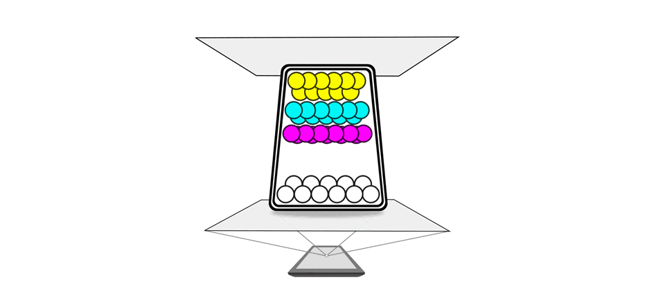

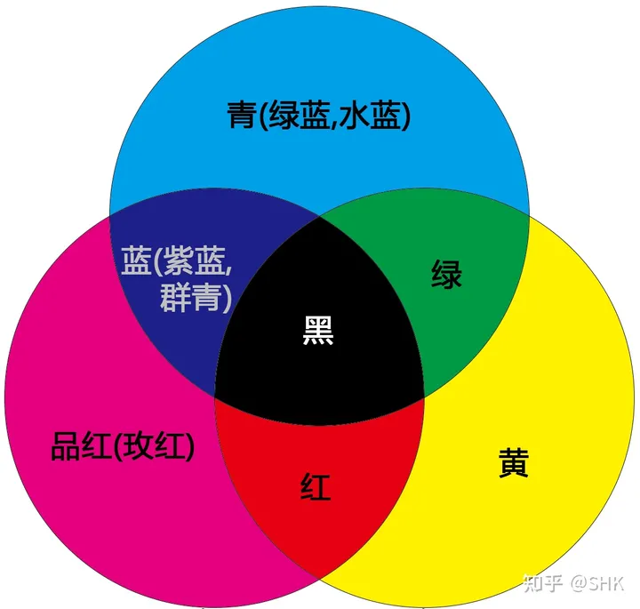

通过控制3原色和白的比例实验彩色显示。还有一种彩色是通过在2色墨水屏前加彩色滤光片来实现，每3个像素(红绿蓝)组成1个点，类似彩色液晶屏。

## 2 刷新方式（全刷、快刷、局刷）

参考文献：

1. [电子纸屏全刷、局刷、快刷有什么区别？_电子纸屏-大连佳显电子有限公司](https://link.zhihu.com/?target=https%3A//www.good-display.cn/news/105.html)（文中视频来源）
2. [Design of Driving Waveform for Shortening Red Particles Response Time in Three-Color Electrophoretic Displays](https://link.zhihu.com/?target=https%3A//www.mdpi.com/2072-666X/12/5/578)（文中插图来源）

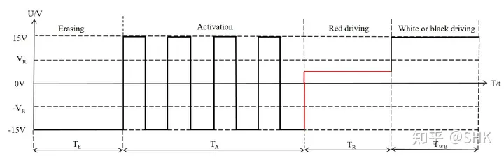

注：最后的Tr和Twb选择出现，不会出现在一个波形中

　　驱动波形分为3个阶段：擦除、激活、显示。

　　擦除：个人认为是为了实现直流平衡（整个波形的平均电压为0）而做的配重。如果是为了擦除应当和之前的显示内容有关，而事实上只与最后的显示内容有关。

　　激活：让液体中颜料粒子分散开，并通过运动让粒子带电（摩擦启电）。可能不对欢迎指正 。

　　显示：根据显示内容设置对应电压。

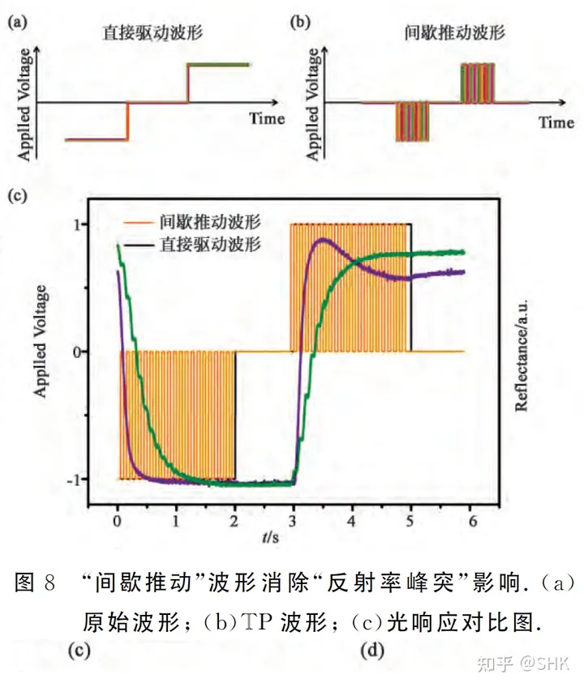

参考文献：彩色电子纸的基础物理与操作原理（[万方数据知识服务平台](https://link.zhihu.com/?target=https%3A//d.wanfangdata.com.cn/periodical/yjyxs201812002)）

　　在显示时，分为2种驱动方式：直接驱动、间歇驱动。

　　直接驱动时反射率如紫色曲线在第4秒出现衰减。间歇驱动可以解决该问题。

### 2.1全刷

　　全刷包括完整的3个阶段：擦除、激活、显示。刷新时间长，期间屏幕快速闪烁（黑、白、黑、白多次交替）

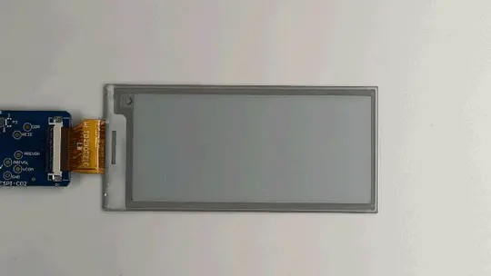

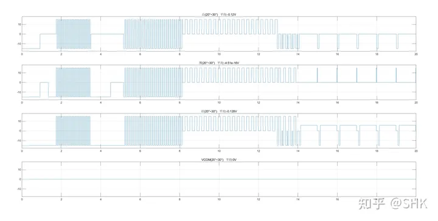

### 2.2快刷

　　快刷省略激活阶段，只有2个阶段：擦除、显示。刷新时间较短，每次更新屏幕闪烁1次（黑、白交替）。不如全刷清晰。

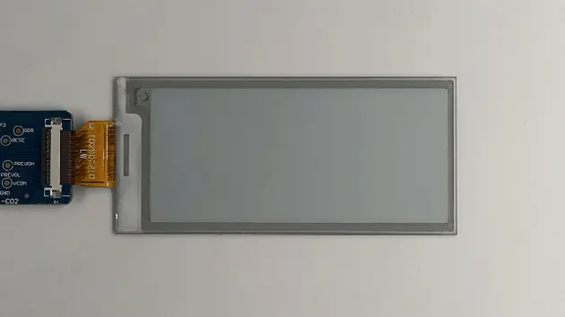

### 2.3局刷

　　局刷只保留显示阶段，省略擦除、激活阶段。速度最快，但也最不清晰，存在显示残影，全刷可清除。

　　全刷闪烁多次，用户体验太差，只能用于很少刷新的价签。电子书大都是局刷和快刷的组合，多次局刷的残影较多时，使用快刷清除。（PS：输入文字这几分钟，我都被上面的全刷gif图给晃眼了。）

### 2.4灰度显示

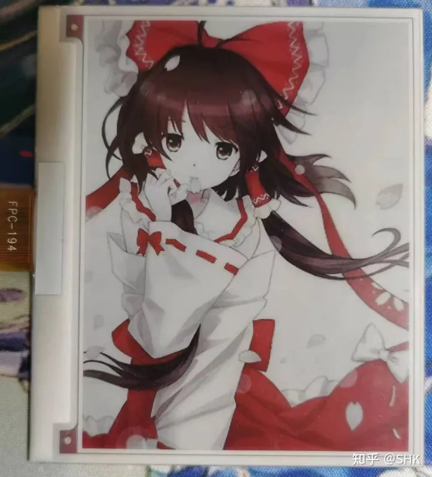

　　通过改变显示阶段的电压时长，可以实现灰度显示。

## 3 驱动方法

参考文献：[谭你：TFT LCD液晶显示器的驱动原理(一)](https://zhuanlan.zhihu.com/p/558649904)（文中插图来源）

　　墨水屏使用成熟的TFT模板驱动。和TFT液晶显示中的TFT驱动原理是一样的。而且由于墨水的刷新率低，且维持显示并不需要变化的电场，用液晶显示中的极性变换方式**。**

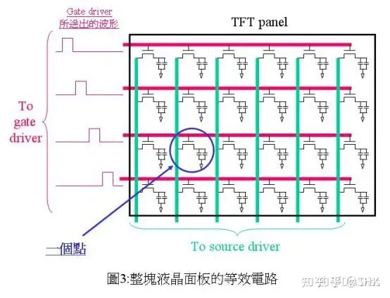

　　为了让墨水屏显示想要的内容，需要按照章节2中介绍的对应颜色的模型施加电压。通过驱动gate和source为每一个像素施加想要的电压。驱动方式分为并口和串口。

### 3.1 并口驱动

参考文献：

1. EPDIY（[https://github.com/vroland/epdiy](https://link.zhihu.com/?target=https%3A//github.com/vroland/epdiy)）
2. Driving E-ink display（[http://essentialscrap.com/eink/index.html](https://link.zhihu.com/?target=http%3A//essentialscrap.com/eink/index.html)）（文中插图来源）详细介绍了怎么驱动gate和source芯片

### 3.1.1 gate驱动

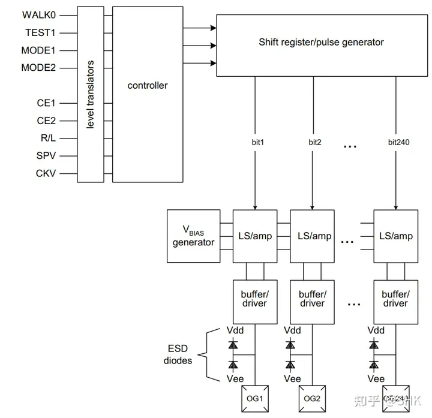

　　gate驱动芯片每次只有一个输出为高，每个CKV信号后换成下一行。其他控制信号用于帧开始、扫描方向、芯片组合等。

### 3.1.2 source驱动

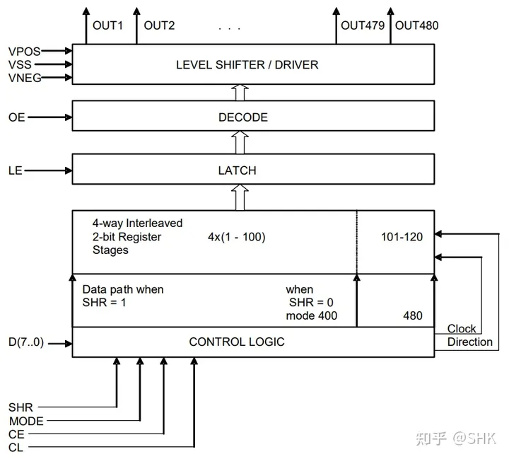

　　将并行D输入的数据变成对应的source中，是一种特殊的串转并芯片，当数据全部输入后关闭上一行gate，通过LE锁存，然后打开对应的gate更新数据。这时继续在source芯片中输入下一行的数据，这时输入的新数据不影响芯片的输出。从而充分的利用时间。

### 3.2 串口驱动

　　墨水屏在刷新时，需要多次电压变化并需要精确控制电压的时间。这对低性能的MCU来说难以实现，于是出现了带有显示缓存的控制芯片。

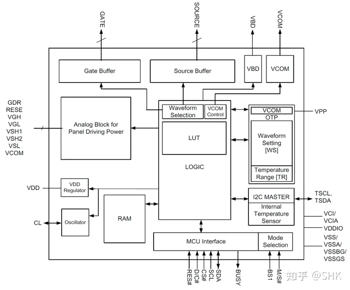

　　MCU通过串口将显示内容写入控制芯片RAM，控制芯片根据RAM内用使用对应颜色的Waveform控制gate和source，完成显示。一般电子价签中的墨水瓶都内置的全刷的Waveform。芯片中Waveform以LUT（look up table）形式保存在芯片中。

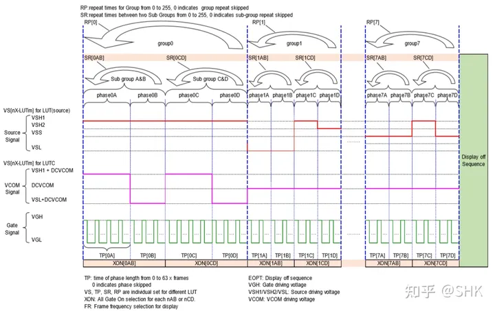