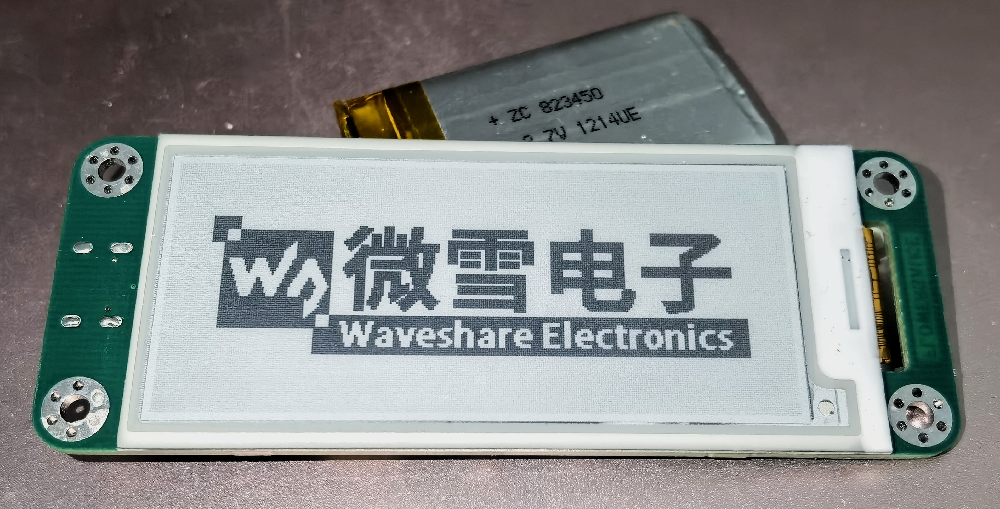
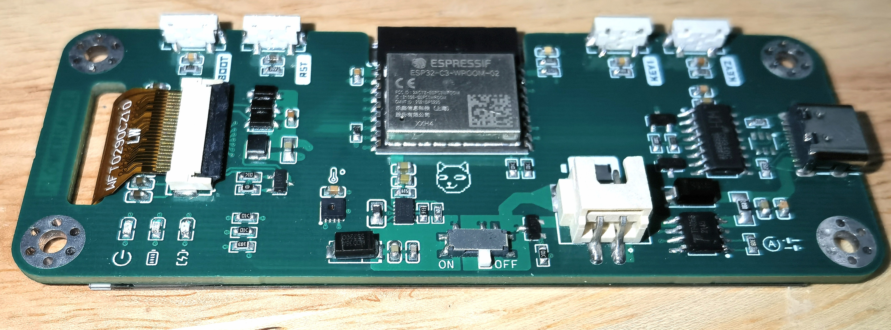
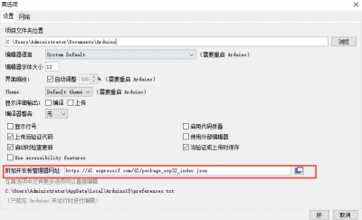
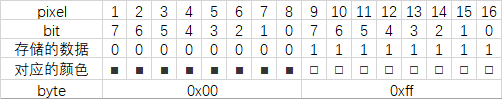
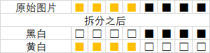
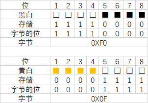
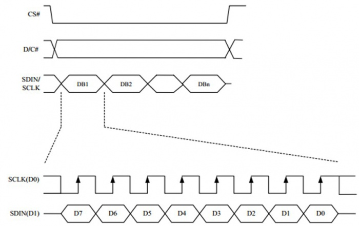
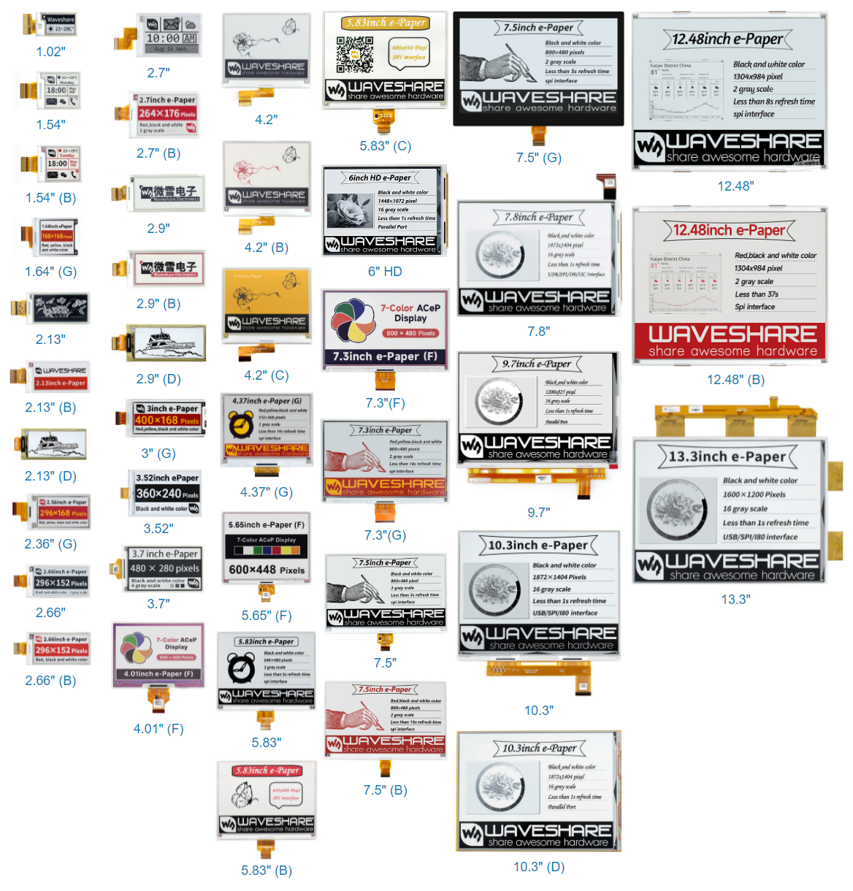

## ESP32C3 EPD2IN9

| 墨水屏型号    | 微雪驱动          | 颜色定义                               |
| ------------- | ----------------- | -------------------------------------- |
| WFT0290CZ10LW | epd2in9d-demo     | 黑白（0x00，0xFF）                     |
| TC021SC1C3-S3 | epd2in13b_V3-demo | 黑白（0x00，0xFF），红白（0x00，0xFF） |
| TC042SC1C3-S5 | epd4in2bc-demo    | 黑白（0x00，0xFF），红白（0xFF，0x00） |

Manual：https://www.waveshare.net/wiki/2.9inch_e-Paper_Module_Manual

ESP32 ：https://www.waveshare.net/wiki/E-Paper_ESP32_Driver_Board

ESP8266：https://www.waveshare.net/wiki/E-Paper_ESP8266_Driver_Board

### Board





[原作者](https://oshwhub.com/flowersauce/esp32-mo-shui-ping-kai-fa-ban_copy_copy) 

尺寸：97x37

主控：ESP32-C3-WROOM-02

锂电池充电IC：TC4056A

锂电池接口：XH2.54 接口

串口通讯：CH340C

DCDC 降压稳压芯片：TPS63802DLAR

温湿度芯片：SHT30

### Demos

- ePape_Esp32_Loader_APP：蓝牙 App 源码（Android Studio）
- examples：本地例程
- Loader_esp32bt：蓝牙例程
- Loader_esp32wf：WiFi 例程（ 仅支持2.4G WiFi ）
- app-release.apk：蓝牙例程 App 安装包

### IDE

#### PlatformIO

用得好好的，突然打不开了，一直 loading？

往 `c:\windows\system32\drivers\etc` 文件中添加以下内容即可：

```
127.0.0.1 localhost
localhost 127.0.0.1
```

测试：在命令行中输入 `pio home`，将会显示以下界面：


#### Arduino

添加开发板：菜单栏->文件->首选项 -> 开发板管理



esp32: https://dl.espressif.com/dl/package_esp32_index.json

esp8266：http://arduino.esp8266.com/stable/package_esp8266com_index.json

esp32\*（./c3/s2/s3）：https://raw.githubusercontent.com/espressif/arduino-esp32/gh-pages/package_esp32_index.json

### E-Paper

#### 原理

微胶囊电泳显示技术，其基本原理是悬浮在液体中的带电纳米粒子受到电场作用而产生迁移。

电子纸显示屏是靠反射环境光来显示图案的，不需要背光。

#### Pixel

白色：□，对应1；黑色：■，对应0。

1Pixel = 1bit，8 Pixel = 1 byte。

* 黑白双色

如 2字节 可表示 16个像素点（前8黑，后8白）

[]()


* 黑白黄三色

将图片拆分为 2 张图片，一张黑白，一张黄白。

在传输时，有两寄存器控制显示，一控制黑白，一控制黄白。

如：8个像素点（前4黄，后4黑），拆分成黑白（前4白，后4黑）和黄白（前4黄，后4白）

[]()

规定白色：□，对应1；黑色/黄色：■，对应0。则：

[]()

之后往相应的颜色控制寄存器写相应值即可。

#### SPI

CPHL=0， CPOL=0，MSB first。



#### Notices

① 进行几次局刷后，需进行次全刷清屏，否则会造成屏幕显示效果异常。

② 长时间上电会损坏膜片，无法修复。屏幕不需要刷新时，需将屏幕设置成睡眠模式，或进行断电处理。

（屏幕进入睡眠模式后，需重新初始化才能刷新）

③ 长期不用墨水屏，最好将墨水屏刷白存放。

---

#### WaveShare EPD

不带后缀的通常为双色屏，以 (B/C) 结尾通常为三色屏 。

| 型号                                                         | 显示颜色       | 灰度 | 分辨率    | 显示尺寸(mm)      | 外形尺寸(mm)            | 刷新 时间(s) | 局部 刷新 | 柔性 | 控制 接口 |
| ------------------------------------------------------------ | -------------- | ---- | --------- | ----------------- | ----------------------- | ------------ | --------- | ---- | --------- |
| [1.02inch e-Paper](https://www.waveshare.net/shop/1.02inch-e-Paper.htm) | 黑、白         | 2    | 128×80    | 21.76 × 14.00     | 32.57 × 18.60 × 0.98    | 2            | √         | -    | SPI       |
| [1.54inch e-Paper](https://www.waveshare.net/shop/1.54inch-e-Paper.htm) | 黑、白         | 2    | 200×200   | 27.00 × 27.00     | 37.32 × 31.80 × 1.05    | 2            | √         | -    | SPI       |
| [1.54inch e-Paper (B)](https://www.waveshare.net/shop/1.54inch-e-Paper-B.htm) | 红、黑、白     | 2    | 200×200   | 27.60 × 27.60     | 37.32 × 31.80 × 1.05    | 14           | -         | -    | SPI       |
| [1.64inch e-Paper (G)](https://www.waveshare.net/shop/1.64inch-e-Paper-G.htm) | 红、黄、黑、白 | 2    | 168×168   | 29.568 × 29.568   | 45.5 × 36.4 × 0.91      | 12           | -         | -    | SPI       |
| [2.13inch e-Paper](https://www.waveshare.net/shop/2.13inch-e-Paper.htm) | 黑、白         | 2    | 250×122   | 48.55 × 23.70     | 59.20 × 29.20 × 1.05    | 2            | √         | -    | SPI       |
| [2.13inch e-Paper (B)](https://www.waveshare.net/shop/2.13inch-e-Paper-B.htm) | 红、黑、白     | 2    | 250×122   | 48.55 × 23.70     | 59.20 × 29.20 × 0.98    | 15           | -         | -    | SPI       |
| [2.13inch e-Paper (D)](https://www.waveshare.net/shop/2.13inch-e-Paper-D.htm) | 黑、白         | 2    | 212×104   | 48.55 × 23.70     | 59.20 × 29.20 × 0.30    | 2            | √         | √    | SPI       |
| [2.36inch e-Paper (G)](https://www.waveshare.net/shop/2.36inch-e-Paper-G.htm) | 红、黄、黑、白 | 2    | 296×168   | 52.096 × 29.568   | 68.1 × 37.9 × 0.85      | 12           | -         | -    | SPI       |
| [2.66inch e-Paper](https://www.waveshare.net/shop/2.66inch-e-Paper.htm) | 黑、白         | 2    | 296×152   | 30.704 × 60.088   | 36.304 × 71.820 × 1.00  | 6            | √         | -    | SPI       |
| [2.66inch e-Paper (B)](https://www.waveshare.net/shop/2.66inch-e-Paper-B.htm) | 红、黑、白     | 2    | 296×152   | 30.704 × 60.088   | 36.304 × 71.820 × 1.00  | 15           | -         | -    | SPI       |
| [2.7inch e-Paper](https://www.waveshare.net/shop/2.7inch-e-Paper.htm) | 黑、白         | 4    | 264×176   | 57.29 × 38.19     | 70.42 × 45.80 × 0.98    | 6            | √         | -    | SPI       |
| [2.7inch e-Paper (B)](https://www.waveshare.net/shop/2.7inch-e-Paper-B.htm) | 红、黑、白     | 2    | 264×176   | 57.288 × 38.192   | 70.42 × 45.80 × 0.98    | 15           | -         | -    | SPI       |
| [2.9inch e-Paper](https://www.waveshare.net/shop/2.9inch-e-Paper.htm) | 黑、白         | 2    | 296×128   | 66.89 × 29.05     | 79.00 × 36.70 × 1.05    | 2            | √         | -    | SPI       |
| [2.9inch e-Paper (B)](https://www.waveshare.net/shop/2.9inch-e-Paper-B.htm) | 红、黑、白     | 2    | 296×128   | 66.90 × 29.06     | 79.00 × 36.70 × 1.18    | 15           | -         | -    | SPI       |
| [2.9inch e-Paper (D)](https://www.waveshare.net/shop/2.9inch-e-Paper-D.htm) | 黑、白         | 2    | 296×128   | 66.90 × 29.06     | 79.00 × 36.70 × 0.34    | 2            | √         | √    | SPI       |
| [3inch e-Paper (G)](https://www.waveshare.net/shop/3inch-e-Paper-G.htm) | 红、黄、黑、白 | 2    | 400 × 168 | 70.4 × 29.568     | 86.4 × 39.2 × 0.85      | 12           | -         | -    | SPI       |
| [3.7inch e-Paper](https://www.waveshare.net/shop/3.7inch-e-Paper.htm) | 黑、白         | 4    | 480×280   | 47.32 × 81.12     | 54.90 × 93.30 × 0.78    | 3            | √         | -    | SPI       |
| [3.52inch e-Paper](https://www.waveshare.net/shop/3.52inch-e-Paper.htm) | 黑、白         | 2    | 360×240   | 74.51 × 49.67     | 84.70 × 54.41 × 1.18    | 1.5          | -         | -    | SPI       |
| [4.01inch e-Paper (F)](https://www.waveshare.net/shop/4.01inch-e-Paper-F.htm) | 7彩色          | 2    | 640×400   | 86.40 × 54.00     | 96.80 × 68.70 × 0.91    | 30           | -         | -    | SPI       |
| [4.2inch e-Paper](https://www.waveshare.net/shop/4.2inch-e-Paper.htm) | 黑、白         | 4    | 400×300   | 84.80 × 63.60     | 91.00 × 77.00 × 1.18    | 4            | -         | -    | SPI       |
| [4.2inch e-Paper (B)](https://www.waveshare.net/shop/4.2inch-e-Paper-B.htm) | 红、黑、白     | 2    | 400×300   | 84.80 × 63.60     | 90.10 × 77.00 × 1.18    | 15           | -         | -    | SPI       |
| [4.2inch e-Paper (C)](https://www.waveshare.net/shop/4.2inch-e-Paper-C.htm) | 黄、黑、白     | 2    | 400×300   | 84.80 × 63.60     | 90.10 × 77.00 × 1.18    | 25           | -         | -    | SPI       |
| [4.37inch e-Paper (G)](https://www.waveshare.net/shop/4.37inch-e-Paper-G.htm) | 红、黄、黑、白 | 2    | 512×368   | 90.11 × 64.77     | 99.5 × 79.5 × 0.85      | 14           | -         | -    | SPI       |
| [5.65inch e-Paper (F)](https://www.waveshare.net/shop/5.65inch-e-Paper-F.htm) | 7彩色          | 2    | 600×448   | 114.9 × 85.8      | 125.4 × 99.5 × 0.91     | <35          | -         | -    | SPI       |
| [5.83inch e-Paper](https://www.waveshare.net/shop/5.83inch-e-Paper.htm) | 黑、白         | 2    | 648×480   | 119.232 × 88.320  | 125.40 × 99.50 × 1.18   | 5            | -         | -    | SPI       |
| [5.83inch e-Paper (B)](https://www.waveshare.net/shop/5.83inch-e-Paper-B.htm) | 红、黑、白     | 2    | 648×480   | 119.232 × 88.320  | 125.40 × 99.50 × 1.18   | 20           | -         | -    | SPI       |
| [5.83inch e-Paper (C)](https://www.waveshare.net/shop/5.83inch-e-Paper-C.htm) | 黄、黑、白     | 2    | 600×448   | 118.80 × 88.26    | 125.40 × 99.50 × 1.18   | 26           | -         | -    | SPI       |
| [6inch HD e-Paper](https://www.waveshare.net/shop/6inch-HD-e-Paper.htm) | 黑、白         | 16   | 1448×1072 | 122.356 × 90.60   | 138.40 × 101.80 × 1.01  | <1           | √         | -    | 并口      |
| [7.3inch e-Paper (F)](https://www.waveshare.net/shop/7.3inch-e-Paper-F.htm) | 7彩色          | 2    | 800 × 480 | 160 × 96          | 170.2 × 111.2 × 0.91    | 35           | -         | -    | SPI       |
| [7.3inch e-Paper (G)](https://www.waveshare.net/shop/7.3inch-e-Paper-G.htm) | 红、黄、黑、白 | 2    | 800 × 480 | 160 × 96          | 170.2 × 111.2 × 0.91    | 16           | -         | -    | SPI       |
| [7.5inch e-Paper](https://www.waveshare.net/shop/7.5inch-e-Paper.htm) | 黑、白         | 2    | 800×480   | 163.20 × 97.92    | 170.20 × 111.20 × 1.18  | 5            | -         | -    | SPI       |
| [7.5inch e-Paper (B)](https://www.waveshare.net/shop/7.5inch-e-Paper-B.htm) | 红、黑、白     | 2    | 800×480   | 163.20 × 97.92    | 170.20 × 111.20 × 1.18  | 16           | -         | -    | SPI       |
| [7.5inch e-Paper (G)](https://www.waveshare.net/shop/7.5inch-e-Paper-G.htm) | 黑、白         | 2    | 800×480   | 163.20 × 97.92    | 177.20 × 118.20 × 2.00  | 5            | -         | -    | SPI       |
| [7.8inch e-Paper](https://www.waveshare.net/shop/7.8inch-e-Paper.htm) | 黑、白         | 16   | 1872×1404 | 158.18 × 118.64   | 173.80 × 127.60 × 0.78  | <1           | √         | -    | 并口      |
| [9.7inch e-Paper](https://www.waveshare.net/shop/9.7inch-e-Paper.htm) | 黑、白         | 16   | 1200×825  | 202.80 × 139.43   | 218.80 × 156.425 × 1.15 | <1           | √         | -    | 并口      |
| [10.3inch e-Paper](https://www.waveshare.net/shop/10.3inch-e-Paper.htm) | 黑、白         | 16   | 1872×1404 | 209.66 × 157.25   | 216.70 × 174.40 × 0.78  | <1           | √         | -    | 并口      |
| [10.3inch e-Paper (D)](https://www.waveshare.net/shop/10.3inch-e-Paper-D.htm) | 黑、白         | 16   | 1872×1404 | 209.664 × 157.248 | 227.70 × 165.80 × 0.647 | <1           | √         | √    | 并口      |
| [12.48inch e-Paper](https://www.waveshare.net/shop/12.48inch-e-Paper.htm) | 黑、白         | 2    | 1304×984  | 252.976 × 190.896 | 261.50 × 211.00 × 1.18  | <8           | -         | -    | SPI       |
| [12.48inch e-Paper (B)](https://www.waveshare.net/shop/12.48inch-e-Paper-B.htm) | 红、黑、白     | 2    | 1304×984  | 252.98 × 190.90   | 261.40 × 211.00 × 1.20  | 37           | -         | -    | SPI       |
| [13.3inch e-Paper](https://www.waveshare.net/shop/13.3inch-e-Paper.htm) | 黑、白         | 16   | 1600×1200 | 270.40 × 202.80   | 285.80 × 213.65 × 0.78  | <1           | √         | -    | 并口      |




